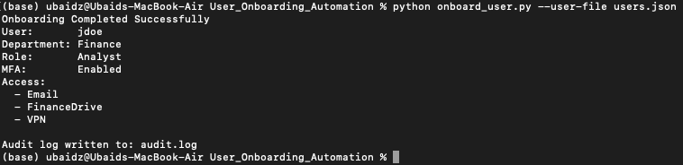

# Enterprise User Onboarding Automation (RBAC & Audit Logging)

## Problem
Manual onboarding/offboarding is error-prone and can cause:
- excessive permissions (least privilege violations)
- missed security controls (e.g., MFA)
- weak traceability without audit logs

## Solution
A Python CLI tool that simulates enterprise identity workflows:
- **Onboard**: validate request → assign **RBAC** permissions → enforce MFA → write audit log
- **Offboard**: disable account → revoke access → invalidate sessions → write audit log

## Why this matters to organisations
Onboarding and (especially) offboarding mistakes are a common source of security incidents.  
Automation improves consistency, reduces human error, and supports compliance through audit trails.

## Tech Stack
- Python 3
- JSON configs (`roles.json`)
- Audit logging (`audit.log`)

## Concepts Demonstrated
- Role-Based Access Control (RBAC)
- Principle of Least Privilege
- Audit Logging
- Secure User Provisioning & Deprovisioning

## How to run

### Onboard (from `users.json`)
```bash
python onboard_user.py --user-file users.json

## Example Output


